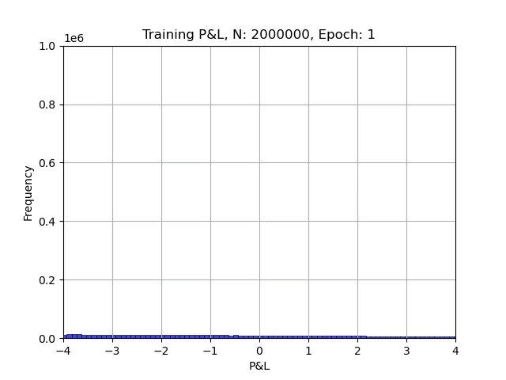
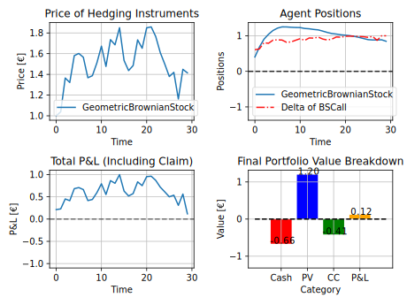
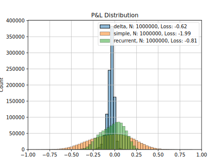
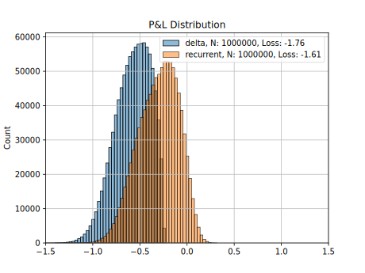

# Deep Hedging: A PyTorch Reproduction

<p align="center">
  
</p>

This project, by [Aadam Wiggers](https://github.com/appie-mathematics) and [Albin Jaldevik](https://github.com/albinjal), is a PyTorch-based reproduction of the paper [Deep Hedging](https://arxiv.org/abs/1802.03042) by Hans Bühler, Lukas Gonon, Josef Teichmann, and Ben Wood. We'd like to extend our gratitude and give full credit for the original concept to these authors. The project is puerly for educational purposes and is not intended for commercial use.

---

## Demo and Results

We present a range of experiments demonstrating what can be achieved with our framework. For a detailed explanation and deeper insights, please refer to our [report](report.pdf).
### Trained Agent Behavior
The following plot showcases the behavior of a trained agent:

<p align="center">
  
</p>

### Final P&L Distribution
We present the final Profit & Loss distribution for two distinct trading costs scenarios:

#### 2% Trading Cost
<p align="center">
  
</p>

#### 25% Trading Cost
<p align="center">
  
</p>

---

## Getting Started

### Run on Kaggle
For a quick and easy start, you can use our [Kaggle notebook](https://www.kaggle.com/code/albinjal/deep-hedge/notebook). This allows you to run the code directly in your browser without any local setup.

### Local Installation
To set up the project on your local machine, follow these steps:

1. **Clone the repository** and navigate to the root directory:
    ```bash
    git clone https://github.com/appie-mathematics/Deep-Hedging
    cd Deep-Hedging
    ```

2. **Install the dependencies**. To do so, run the following command:
    ```bash
    conda env create -f environment.yml
    ```
    _Note: This requires [Conda](https://docs.conda.io/en/latest/) to be installed on your machine. The above command creates a conda environment named `deep-hedge`._

    To activate the environment, use:
    ```bash
    conda activate deep-hedge
    ```

3. **Run the code** by executing the following command:
    ```bash
    python src/main.py
    ```

---

## Contact

For any inquiries, feel free to open an issue on this GitHub repository or contact us directly.
